# Android组件化框架设计与实践

在目前移动互联网时代，每个 APP 就是流量入口，与过去 PC Web 浏览器时代不同的是，APP 的体验与迭代速度影响着用户的粘性，这同时也对从事移动开发人员提出更高要求，进而移动端框架也层出不穷。

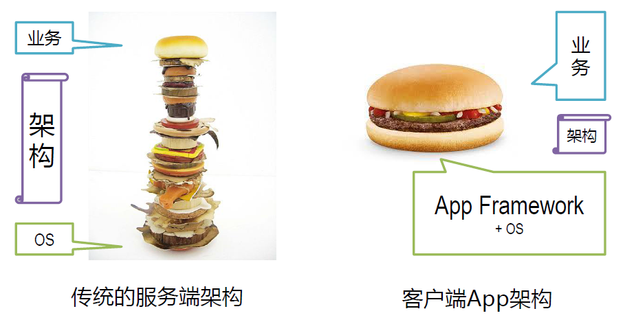

上图显示的是传统的服务端架构和客户端 App 架构对比。传统的服务端架构中最底下是一个 OS，一般是 Linux，最上面服务端的业务，而中间有非常多的层次可以在架构上，按照我们的意愿搭建中间的各个层次的衔接环节，使得架构具有足够的灵活性和扩展性。但是到了 App 就会面对一个完全不同的现状，App 的OS（Android或iOS）本质上并不是一个很瘦的像 Linux 这样的 OS，而是在 OS 上有一个很重的 App Framework，开发一个普通的客户端应用所要用到的绝大多数接口都在 Framework 里，而上面的业务也是一个非常复杂多样化的业务，最后会发现“架构”是在中间的一个非常尴尬的夹心层，因为会遇到很多在服务端架构中不需要面临的挑战。比如以下两点：

- 体积的制约。体积对用户来说是一个非常敏感的概念，如果我们要在架构上做很多事情的话，通常意味着架构占据的代码量会比较大。在服务端架构中我们可以容忍我们在架构层面去做几十兆的代码。但是对于客户端架构，即使你的架构只有一两兆，对于一个客户端可能都占据了 10%，20%的容量。
- 性能的挑战。从性能上来看，对于服务端架构我们通常关注的是吞吐率，我们不会去关注启动速度。一个服务端的启动哪怕是花了一两分钟，只要它运作起来吞吐率足够高，支持的并发能力足够好，响应速度足够快，我们就认为这是一个良好的架构。但客户端不同，客户端的进程对用户而言，往往是一个栈态的，手机里面使用完一个应用，退出之后可能过不了多久就会被回收掉，当用户下次再打开的时候，它会再次启动进程，需要重新完成一次初始化的流程。如果在这个上面做了很多事情的话，会导致程序启动的速度会很慢，在很多用户看来，这就是一种不可接受的用户体验。


客户端 APP 与服务端在架构上是有着一定的区别，在选择对客户端架构需要谨慎对待，需要有许多权衡的条件，在此前提上，是否有一种归一的方式呢，可以分而治之，并行开发，把业务分隔成一个个单独的组件，整个架构围绕组件开发，构建也是组件，一切皆组件。答案是有的，那就是打造客户端组件框架。


### 起源，为何组件化

客户端 APP 自身在飞速发展，APP 版本不断迭代，新功能不断增加，业务模块数量不断增加，业务上的处理逻辑越变越复杂，同时每个模块代码也变得越来越多，这就引发一个问题，所维护的代码成本越来越高，稍微一改动可能就牵一发而动全身，改个小的功能点就需要回归整个 APP 测试，这就对开发和维护带来很大的挑战。同时原来APP 架构方式是单一工程模式，业务规模扩大，随之带来的是团队规模扩大，那就涉及到多人协作问题，每个移动端软件开发人员势必要熟悉如此之多代码，如果不按照一定的模块组件机制去划分，将很难进行多人协作开发，随着单一项目变大，而且 Andorid 项目在编译代码方面就会变得非常卡顿，在单一工程代码耦合严重，每修改一处代码后都需要重新编译打包测试，导致非常耗时，最重要的是这样的代码想要做单元测试根本无从下手，所以必须要有一个更灵活的架构去代替过去单一工程模式。

同样这样的问题在我们工作具体项目中处处碰到，就拿我们组内负责的某个移动端 APP 来说，就碰到如下几个问题：

1. 代码量膨胀，不利于维护，不利于新功能的开发。
2. 项目工程构建速度慢，在一些电脑上写两句代码，重新编译测试的话编译速度起码 10-20 分钟，有的甚至更长。
3. 不同模块之间代码耦合严重，比如消息模块严重耦合视频模块，如果修改视频模块，相应的消息模块也需要修改，不然会产生一连串问题。
4. 每个模块之间都有引用第三方库，但有些第三方库版本不一致，导致打包 APP 时候代码冗余，容易引起版本冲突。
5. 有些定制项目如果只需要消息模块，其他模块不需要的话，做不到按需加载打包，因为模块之间有互联依赖。
6. 现有项目基于以前其他人项目基础上开发，经手的人次过多，存在着不同的代码风格，项目中代码规范乱，类似的功能写法却不一样，导致不统一。


项目工程架构模式改变是大势所趋，那又该如何做呢？那就是：**打造组件化开发框架**，用以解决目前所面临问题，在讲解如何打造之前，需要谈谈组件化概念，组件化框架是什么。


### 概念，组件化是什么

问：什么是组件，什么是组件化？

答：在软件开发领域，**组件（Component）**是对数据和方法的简单封装，功能单一，高内聚，并且是业务能划分的最小粒度。举个我们生活中常见的例子就是电脑主板上每个元件电容器件，每个元件负责的功能单一、容易组装、即插即拔，但作用有限，需要一定的依赖条件才可使用。如下图：

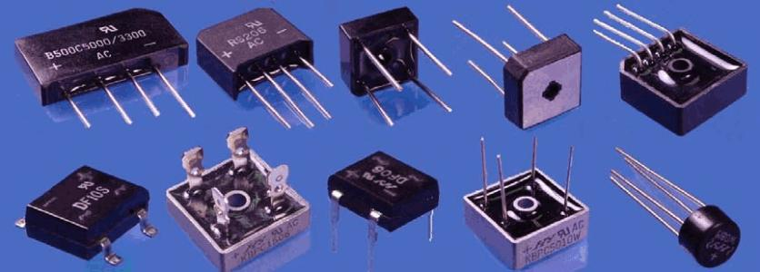

那么同样，**组件化** 就是基于组件可重用的目的上，将一个大的软件系统按照分离关注点的形式，拆分成多个独立的组件，使得整个软件系统也做到电路板一样，是单个或多个组件元件组装起来，哪个组件坏了，整个系统可继续运行，而不出现崩溃或不正常现象，做到更少的耦合和更高的内聚。


问：组件化、模块化容易混淆，两者区别又是什么？

答：模块化就是将一个程序按照其功能做拆分，分成相互独立的模块，以便于每个模块只包含与其功能相关的内容，模块我们相对熟悉,比如登录功能可以是一个模块,搜索功能可以是一个模块等等。而组件化就是更关注可复用性，更注重关注点分离，如果从集合角度来看的话，可以说往往一个模块包含了一个或多个组件，或者说模块是一个容器，由组件组装而成。简单来说，组件化相比模块化粒度更小，两者的本质思想都是一致的，都是把大往小的方向拆分，都是为了复用和解耦，只不过模块化更加侧重于业务功能的划分，偏向于复用，组件化更加侧重于单一功能的内聚，偏向于解耦。


问：组件化能带来什么好处？

答：简单来说就是提高工作效率，解放生产力，好处如下：

- 代码简洁，冗余量少，维护方便，易扩展新功能。
- 提高编译速度，从而提高并行开发效率。
- 避免模块之间的交叉依赖，做到低耦合、高内聚。
- 引用的第三方库代码统一管理，避免版本统一，减少引入冗余库。
- 定制项目可按需加载，组件之间可以灵活组建，快速生成不同类型的定制产品。
- 制定相应的组件开发规范，可促成代码风格规范，写法统一。
- 系统级的控制力度细化到组件级的控制力度，复杂系统构建变成组件构建。
- 每个组件有自己独立的版本，可以独立编译、测试、打包和部署。


### 设计，构建组件化框架

回到刚开始讲的 APP 单一工程模式，看张常见 APP 单一工程模式架构图：

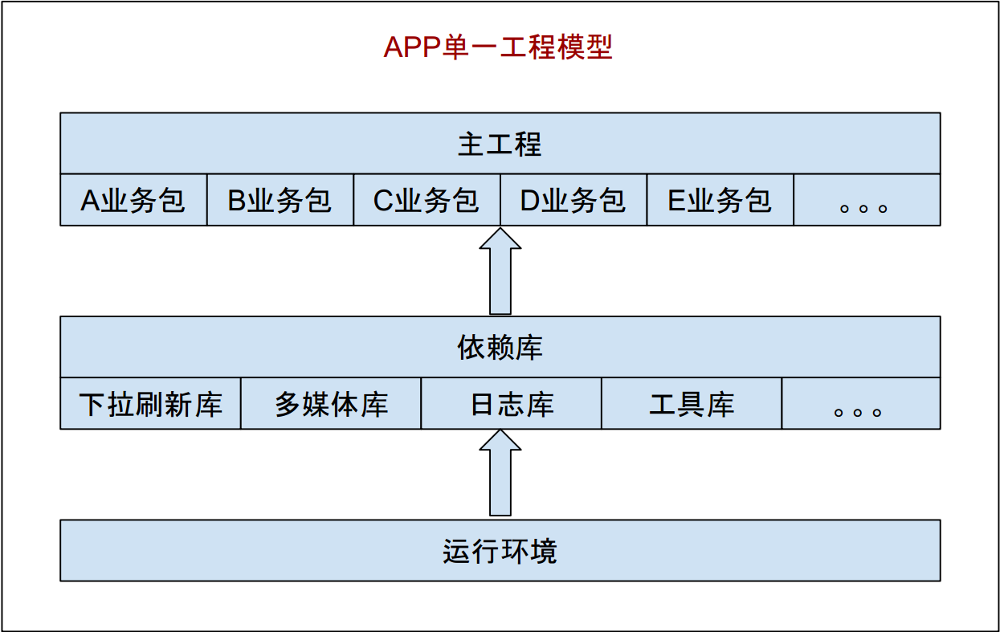

上图是目前比较普遍使用的 Android APP 技术架构，往往是在一个界面中存在大量的业务逻辑，而业务逻辑中充斥着各种网络请求、数据操作等行为，整个项目中也没有模块的概念，只有简单的以业务逻辑划分的文件夹，并且业务之间也是直接相互调用、高度耦合在一起的。单一工程模型下的业务关系，总的来说就是：你中有我，我中有你，相互依赖，无法分离。如下图：

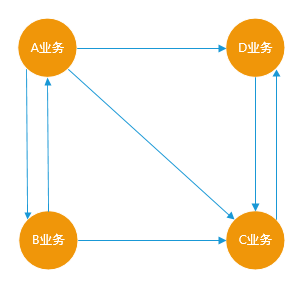

组件化的指导思想是：分而治之，并行开发，一切皆组件。要实现组件化，无论采用什么样的技术方式，需要考虑以下七个方面问题：

1. 代码解耦。如何将一个庞大的工程分成有机的整体？
2. 组件单独运行。因为每个组件都是高度内聚的，是一个完整的整体，如何让其单独运行和调试？

3. 组件间通信。由于每个组件具体实现细节都互相不了解，但每个组件都需要给其他调用方提供服务，那么主项目与组件、组件与组件之间如何通信就变成关键？
4. UI 跳转。UI 跳转指的是特殊的数据传递，跟组件间通信区别有什么不同？
5. 组件生命周期。这里的生命周期指的是组件在应用中存在的时间，组件是否可以做到按需、动态使用、因此就会涉及到组件加载、卸载等管理问题。
6. 集成调试。在开发阶段如何做到按需编译组件？一次调试中可能有一两个组件参与集成，这样编译时间就会大大降低，提高开发效率。
7. 代码隔离。组件之间的交互如果还是直接引用的话，那么组件之间根本没有做到解耦，如何从根本上避免组件之间的直接引用，也就是如何从根本上杜绝耦合的产生？


组件化架构目标：告别结构臃肿，让各个业务变得相对独立，业务组件在组件模式下可以独立开发，而在集成模式下又可以变为 AAR 包集成到“ APP 壳工程”中，组成一个完整功能的 APP。

先给出框架设计图，然后再对这七个问题进行一一解答。

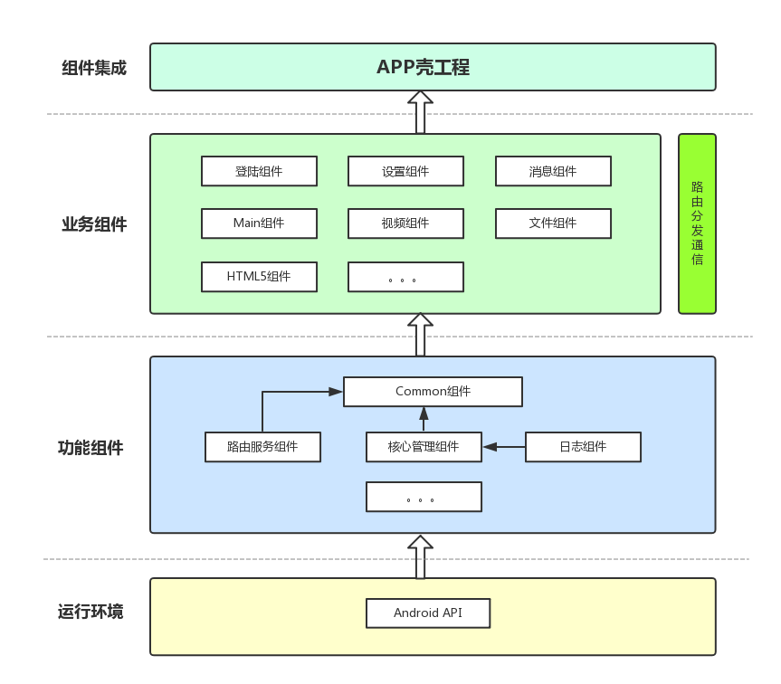


从图中可以看到，**业务组件之间是独立的，互相没有关联**，这些业务组件在集成模式下是一个个 Library，被 APP 壳工程所依赖，组成一个具有完整业务功能的 APP 应用，但是在组件开发模式下，业务组件又变成了一个个 Application，它们可以独立开发和调试，由于在组件开发模式下，业务组件们的代码量相比于完整的项目差了很远，因此在运行时可以显著减少编译时间。

各个业务组件通信是通过路由转发，如图：

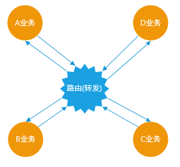

这是组件化工程模型下的业务关系，业务之间将不再直接引用和依赖，而是通过“路由”这样一个中转站间接产生联系。

那么针对以上提出的七个问题，具体解决如下：

1，代码解耦问题

对已存在的项目进行模块拆分，模块分为两种类型，一种是功能组件模块，封装一些公共的方法服务等，作为依赖库对外提供，一种是业务组件模块，专门处理业务逻辑等功能，这些业务组件模块最终负责组装APP。


2，组件单独运行问题

通过 **Gradle ** 脚本配置方式，进行不同环境切换。比如只需要把 Apply plugin: 'com.android.library' 切换成Apply plugin: 'com.android.application' 就可以，同时还需要在 AndroidManifest 清单文件上进行设置，因为一个单独调试需要有一个入口的 Activity。比如设置一个变量 isModule，标记当前是否需要单独调试，根据isModule 的取值，使用不同的 gradle 插件和 AndroidManifest 清单文件，甚至可以添加 Application 等 Java 文件，以便可以做一下初始化的操作。


3，组件间通信问题

通过接口+实现的结构进行组件间的通信。每个组件声明自己提供的服务 Service API，这些 Service 都是一些接口，组件负责将这些 Service 实现并注册到一个统一的路由 Router 中去，如果要使用某个组件的功能，只需要向Router 请求这个 Service 的实现，具体的实现细节我们全然不关心，只要能返回我们需要的结果就可以了。在组件化架构设计图中 Common 组件就包含了路由服务组件，里面包括了每个组件的路由入口和跳转。


4，UI 跳转问题

可以说 UI 跳转也是组件间通信的一种，但是属于比较特殊的数据传递。不过一般 UI 跳转基本都会单独处理，一般通过短链的方式来跳转到具体的 Activity。每个组件可以注册自己所能处理的短链的 Scheme 和 Host，并定义传输数据的格式，然后注册到统一的 UIRouter 中，UIRouter 通过 Scheme 和 Host 的匹配关系负责分发路由。但目前比较主流的做法是通过在每个 Activity 上添加注解，然后通过 APT 形成具体的逻辑代码。目前方式是引用阿里的 [ARouter](https://github.com/alibaba/ARouter) 框架，通过注解方式进行页面跳转。


5，组件生命周期问题

在架构图中的核心管理组件会定义一个组件生命周期接口，通过在每个组件设置一个配置文件,这个配置文件是通过使用注解方式在编译时自动生成，配置文件中指明具体实现组件生命周期接口的实现类，来完成组件一些需要初始化操作并且做到自动注册，暂时没有提供手动注册的方式。


6，集成调试问题

每个组件单独调试通过并不意味着集成在一起没有问题，因此在开发后期我们需要把几个组件机集成到一个 APP 里面去验证。由于经过前面几个步骤保证了组件之间的隔离，所以可以任意选择几个组件参与集成，这种按需索取的加载机制可以保证在集成调试中有很大的灵活性，并且可以加大的加快编译速度。需要注意的一点是，每个组件开发完成之后，需要把 isModule 设置为 true并同步，这样主项目就可以通过参数配置统一进行编译。


7，代码隔离问题

如果还是 compile project(xxx:xxx.aar) 来引入组件，我们就完全可以直接使用到其中的实现类，那么主项目和组件之间的耦合就没有消除，那之前针对接口编程就变得毫无意义。我们希望只在 assembleDebug 或者 assembleRelease 的时候把 AAR 引入进来，而在开发阶段，所有组件都是看不到的，这样就从根本上杜绝了引用实现类的问题。

目前做法是主项目只依赖 Common 的依赖库，业务组件通过路由服务依赖库按需进行查找，用反射方式进行组件加载，然后在主工程中调用组件服务，组件与组件之间调用则是通过接口+实现进行通信，后续规划通过自定义Gradle 插件，通过字节码自动插入组件的依赖进行编译打包，实现自动筛选 assembleDebug 或 assembleRelease 这两个编译命任务，只有属于包含这两个任务的命令才引入具体实现类，其他的则不引入。


### 代码，具体项目实践

**一，创建工程**

1，APP空壳工程

通过AndroidStudio创建一个APP空壳工程，如图：

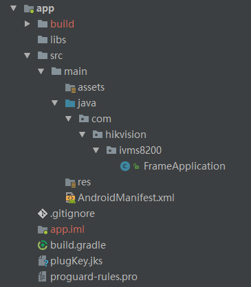

然后在 APP 工程添加依赖具体业务组件 Module。比如：

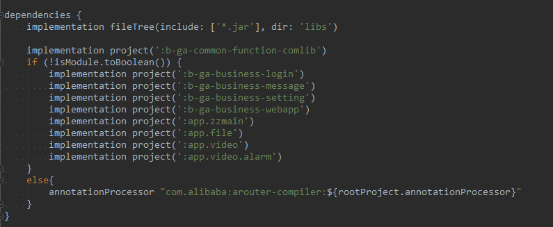


2，具体业务组件Module

需要遵循一定组件命名规范，为何需要规范呢，因为需要通过组件命名规范来约束和保证组件的统一性和一致性，避免出现冲突。比如登陆组件，那么名称：b(类型)-ga(部门缩写)-login(组件名称)，这就是我们基于共同的约定进行命名的，为后期维护和扩展都带来辨识度。


**二，业务组件配置文件**

1，build.gradle配置文修改。如下：

```java
if (isModule.toBoolean()) {
    apply plugin: 'com.android.application'
} else {
    apply plugin: 'com.android.library'
}

android {
    compileSdkVersion rootProject.ext.compileSdkVersion
    buildToolsVersion rootProject.ext.buildToolsVersion

    defaultConfig {
        minSdkVersion rootProject.ext.minSdkVersion
        targetSdkVersion rootProject.ext.targetSdkVersion

        if (isModule.toBoolean()) {
            applicationId "com.hik.ga.business.login"
            versionCode 1
            versionName "1.0"
        } else {
            //ARouter
            javaCompileOptions {
                annotationProcessorOptions {
                    arguments = [ moduleName : project.getName() ]
                }
            }
        }
    }

    sourceSets {
        main {
            if (isModule.toBoolean()) {
                manifest.srcFile 'src/main/module/AndroidManifest.xml'
            } else {
                manifest.srcFile 'src/main/AndroidManifest.xml'
                //集成开发模式下排除debug文件夹中的所有Java文件
                java {
                    exclude 'debug/**'
                }
            }
        }
    }

    buildTypes {
        release {
            minifyEnabled false
            proguardFiles getDefaultProguardFile('proguard-android.txt'), 'proguard-rules.pro'
        }
    }

}

dependencies {
    implementation project(':b-ga-common-function-comlib')

    if (!isModule.toBoolean()) {
        annotationProcessor "com.alibaba:arouter-compiler:${rootProject.annotationProcessor}"
    }
}
```

这里需要有几点说明一下：

1，通过 isModule.toBoolean() 方法来进行组件间集成模式和组件模式的切换，包括模块是属于Application 还是 Library，由于集成了 ARouter，所以需要对 ARouter 配置文件进行处理。

2，如果组件模式下， 则需要重新设置 AndroidManifest.xml 文件，里面配置新的Application路径。比如Login组件单独运行 AndroidManifest 清单文件

```java
<manifest xmlns:android="http://schemas.android.com/apk/res/android"
    package="hik.ga.business.applogin" >

    <application
        android:name="debug.LoginApplication"
        android:allowBackup="false"
        android:icon="@mipmap/ic_launcher"
        android:label="@string/login_btn_str"
        android:supportsRtl="true"
        android:theme="@style/Theme.AppCompat.Light.NoActionBar">

        <activity
            android:name="hik.ga.business.applogin.login.views.LoginActivity"
            android:label="@string/login_btn_str"
            android:launchMode="singleTop"
            android:screenOrientation="portrait"
            android:theme="@style/AppTheme.NoActionBarFullScreen">
            <intent-filter>
                <action android:name="android.intent.action.MAIN" />
                <category android:name="android.intent.category.LAUNCHER" />
            </intent-filter>
        </activity>

    </application>
</manifest>
```

3，实现组件全局应用配置类，这个类的目的是在组件加载时初始化一些组件自身的资源，如下：

```java
public class LoginApplicationDelegate implements IApplicationDelegate {

    private static final String TAG = "LoginApplicationDelegate";

    @Override
    public void onCreate() {
        EFLog.d(TAG, "*------------------onCreate()---------------->");
    }

    @Override
    public void enterBackground() {
        EFLog.d(TAG, "*------------------enterBackground()---------------->");
    }

    @Override
    public void enterForeground() {
        EFLog.d(TAG, "*------------------enterForeground()---------------->");
    }

    @Override
    public void receiveRemoteNotification(Map<String, String> message) {
        EFLog.d(TAG, "receiveRemoteNotification msg = " + message);
    }

    @Override
    public void onTerminate() {
        EFLog.d(TAG, "*------------------onTerminate()---------------->");
    }

    @Override
    public void onConfigurationChanged(Configuration configuration) {
        EFLog.d(TAG, "*------------------onConfigurationChanged()---------------->");
    }

    @Override
    public void onLowMemory() {
        EFLog.d(TAG, "*------------------onLowMemory()---------------->");
    }

    @Override
    public void onTrimMemory(int var1) {
        EFLog.d(TAG, "*------------------onTrimMemory()---------------->");
    }
}
```


**三，路由服务**

1，定义公共组件路由API和入口，通过路由服务组件查找，如图：

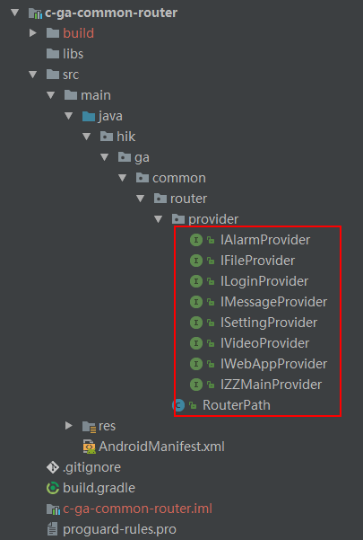


2，组件路由实现

每个组件对外提供什么能力，首先需要在路由服务组件创建一个接口文件，如下是登陆组件接口声明和实现。

Login 接口：

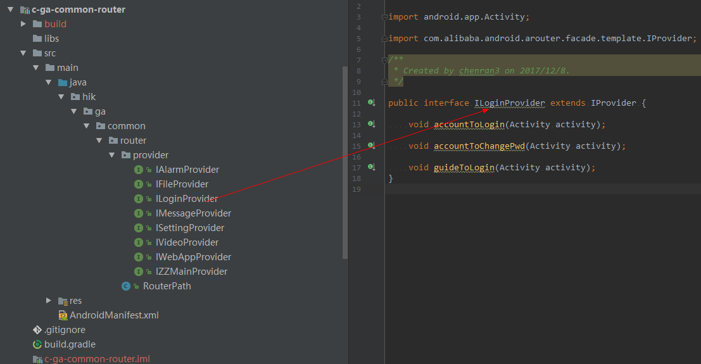


具体实现：

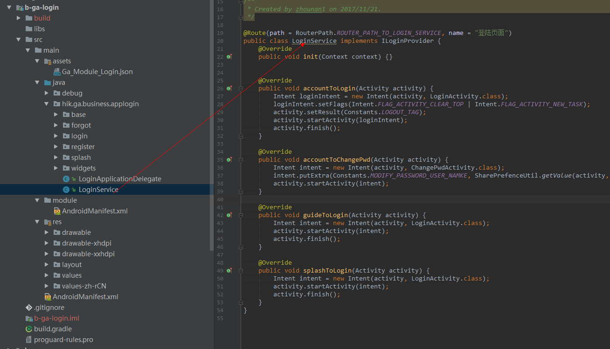


路由使用：比如我们想从设置页面跳转到登陆页面，使用 Login 接口里的方法，使用如下：

```java
ILoginProvider loginService = (ILoginProvider) ARouter.getInstance().build(RouterPath.ROUTER_PATH_TO_LOGIN_SERVICE).navigation();
if(loginService != null){
	loginService.accountToLogin(AccountActivity.this);
}
```


### 小结

总的来说，通过应用组件化框架，使得我们工作中的具体项目变得更轻、好组装、编译构建更快，不仅提高工作效率，同时自我对移动应用开发认知有进一步的提升。因为组件化框架具有通用性，特别适用于业务模块迭代多，量大的大中型项目，是一个很好的解决方案。至于组件化框架之后演化的道路，则是打造组件仓库，完善组件开发规范，丰富组件功能库，有一些粒度大的业务组件可以进一步的细化，对组件功能进行更单一的内聚，同时基于现有组件化框架，便于过度在未来打造插件化框架，进一步升级 APP 动态能力，比如热加载、热修复等，那又是另一种使用场景和设计架构了，其实组件化和插件化框架最大的区别就是在是否具备动态更新能力。


参考文章：

1，[Android组件化方案](http://blog.csdn.net/guiying712/article/details/55213884)

2，[Android彻底组件化方案实践](https://www.jianshu.com/p/1b1d77f58e84)

